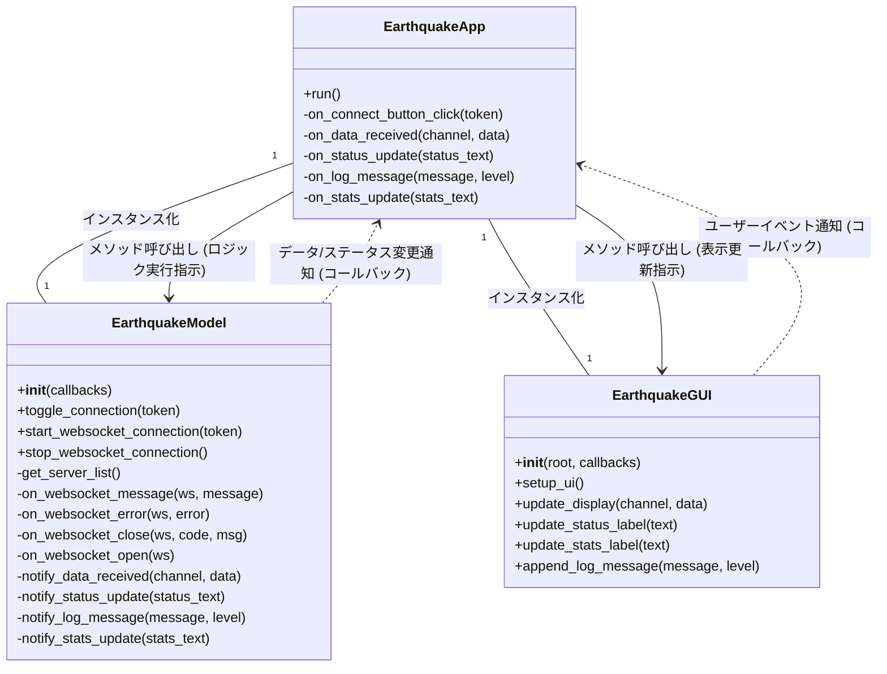

# AXIS地震情報モニター アプリケーション再構築計画

## 1. 目標

*   既存の `axis_earthquake_gui.py` ファイル内のGUIロジックとWebSocket通信ロジックを明確に分離する。
*   コードの可読性、保守性、テスト容易性を向上させる。
*   将来的なGUIの大幅な変更や機能追加に柔軟に対応できる、拡張性の高いアーキテクチャを構築する。
*   特にGUI部分は、後からの大幅な改良に耐えうる汎用性と柔軟性を持たせる。

## 2. 採用アーキテクチャ

Tkinterアプリケーションの特性と、既存コードからの段階的な移行を考慮し、**Model-View-Controller (MVC)** パターンに近い形で分離を行います。

## 3. 新しいファイル構造

現在の `axis-earthquake-monitor/` ディレクトリ内に、以下の新しいファイルを作成し、既存のファイルを修正します。

```
axis-earthquake-monitor/
├── axis_earthquake_app.py    # アプリケーションのエントリポイント (Controllerの役割も兼ねる)
├── axis_earthquake_gui.py    # GUI (View) の定義 (既存ファイルを修正)
├── axis_earthquake_model.py  # データと通信ロジック (Model) の定義 (新規作成)
└── PLAN.md                   # 本計画ファイル
└── ... (その他の既存ファイル)
```

## 4. 各コンポーネントの役割詳細

### 4.1. `axis_earthquake_model.py` (Model)

*   **クラス名**: `EarthquakeModel`
*   **責務**:
    *   AXISサーバーとのWebSocket通信の確立、維持、切断。
    *   受信データの解析と構造化。
    *   地震データログの管理。
    *   データの変更やステータス更新があった際に、Controllerに通知するメカニズムを提供。
*   **主要メソッド/属性**:
    *   `__init__(self, callbacks)`: Controllerからのコールバック関数を受け取る。
    *   `get_server_list()`: AXISサーバーリストをHTTPリクエストで取得。
    *   `toggle_connection(token)`: 接続の開始/停止を制御。
    *   `_connect_websocket(token)`: WebSocket接続の実際の処理（別スレッドで実行）。
    *   `stop_websocket_connection()`: WebSocket接続を安全に停止。
    *   `on_websocket_message(ws, message)`: WebSocketメッセージ受信時の処理。
    *   `on_websocket_error(ws, error)`: WebSocketエラー発生時の処理。
    *   `on_websocket_close(ws, code, msg)`: WebSocket接続終了時の処理。
    *   `on_websocket_open(ws)`: WebSocket接続開始時の処理。
    *   `data_log`: 受信した地震データを格納するリスト。
    *   `notify_data_received(channel, data)`: 受信データをControllerに通知。
    *   `notify_status_update(status_text)`: 接続ステータスをControllerに通知。
    *   `notify_log_message(message, level)`: ログメッセージをControllerに通知。
    *   `notify_stats_update(stats_text)`: 統計情報をControllerに通知。

### 4.2. `axis_earthquake_gui.py` (View)

*   **クラス名**: `EarthquakeGUI` (既存の `AXISEarthquakeGUI` をリネーム)
*   **責務**:
    *   Tkinterウィジェットの配置、レイアウト、スタイリング。
    *   ModelからController経由で提供されたデータをユーザーに表示する。
    *   ユーザーからの入力イベント（ボタンクリックなど）を検知し、Controllerに通知する。
    *   自身ではビジネスロジックや通信ロジックを一切持たない。
*   **主要メソッド/属性**:
    *   `__init__(self, root, callbacks)`: TkinterルートとControllerからのコールバック関数を受け取る。
    *   `setup_ui()`: GUIの各要素を配置し、イベントハンドラを設定。
    *   `update_display(channel, data)`: 受信した地震データを整形して表示。
    *   `update_status_label(text)`: 接続ステータス表示を更新。
    *   `update_stats_label(text)`: 統計情報表示を更新。
    *   `append_log_message(message, level)`: ログメッセージをテキストエリアに追加。
    *   `clear_display()`: 表示エリアをクリア。
*   **GUIの汎用性に関する考慮事項**:
    *   `EarthquakeGUI` は、特定のデータ形式（例: `jmx-seismology` の詳細な構造）に直接依存せず、Controllerから整形された表示用データを受け取るように設計する。これにより、データ形式が変更されてもGUI側の修正を最小限に抑える。
    *   UI要素の配置ロジック（`grid` 設定など）は、将来的なウィジェットの追加やレイアウト変更が容易なように、モジュール化または明確なセクション分けを行う。
    *   表示ロジックは、可能な限り汎用的なテキスト表示やラベル更新に留め、複雑なデータ変換や条件分岐はControllerまたはModelに任せる。

### 4.3. `axis_earthquake_app.py` (Controller & Main Entry Point)

*   **クラス名**: `EarthquakeApp`
*   **責務**:
    *   アプリケーションのメインエントリポイントとして機能する。
    *   `tk.Tk()` インスタンスを作成し、アプリケーションのルートウィンドウを設定する。
    *   `EarthquakeModel` と `EarthquakeGUI` のインスタンスを作成し、両者を初期化する。
    *   `EarthquakeGUI` からのユーザー操作イベント（例: 接続ボタンクリック）を受け取り、それに応じて `EarthquakeModel` の適切なメソッド（例: `toggle_connection`）を呼び出す。
    *   `EarthquakeModel` からのデータ更新やステータス変更の通知（コールバック）を受け取り、それに応じて `EarthquakeGUI` の表示更新メソッドを呼び出す。
    *   アプリケーションのライフサイクル管理（ウィンドウクローズ時の処理など）を行う。
*   **主要メソッド/属性**:
    *   `run()`: アプリケーションの起動とメインループの開始。
    *   `on_connect_button_click(token)`: GUIからの接続ボタンクリックイベントを処理し、Modelに接続指示を出す。
    *   `on_data_received(channel, data)`: Modelからのデータ受信通知を受け取り、GUIに表示更新を指示する。
    *   `on_status_update(status_text)`: Modelからのステータス更新通知を受け取り、GUIに表示更新を指示する。
    *   `on_log_message(message, level)`: Modelからのログメッセージ通知を受け取り、GUIに表示更新を指示する。
    *   `on_stats_update(stats_text)`: Modelからの統計情報更新通知を受け取り、GUIに表示更新を指示する。
    *   `on_closing()`: ウィンドウクローズ時の処理。

## 5. コンポーネント間の連携フロー



## 6. 実装ステップの概要

1.  **`axis_earthquake_model.py` の新規作成**:
    *   `EarthquakeModel` クラスを定義し、現在の `axis_earthquake_gui.py` からWebSocket通信、データ解析、データログ管理に関するすべてのロジック（`get_server_list`, `_connect_websocket`, `on_message`, `on_error`, `on_close`, `on_open`, `stop_connection`, `data_log` など）を移動します。
    *   ModelからControllerへの通知のために、コンストラクタでコールバック関数を受け取るメカニズムを実装します（例: `self.callbacks = callbacks` として、`self.callbacks['on_data_received'](...)` のように呼び出す）。

2.  **`axis_earthquake_gui.py` の修正**:
    *   クラス名を `AXISEarthquakeGUI` から `EarthquakeGUI` に変更します。
    *   WebSocket通信やデータ解析のロジックを完全に削除します。
    *   `__init__` メソッドで、Controllerから渡されるイベントハンドラ（コールバック関数）を受け取るように変更します。
    *   「接続開始」ボタンの `command` を、Modelのメソッドを直接呼び出すのではなく、Controllerに渡されたコールバック関数を呼び出すように変更します。
    *   `log_message`, `_display_earthquake_data`, `update_stats` などのメソッドは、Controllerからデータを受け取り、GUIを更新する純粋なViewの役割に特化させます。

3.  **`axis_earthquake_app.py` の新規作成**:
    *   アプリケーションのメインエントリポイントとなる `main()` 関数を定義します。
    *   `tk.Tk()` を初期化し、`EarthquakeModel` と `EarthquakeGUI` のインスタンスを作成します。
    *   `EarthquakeModel` と `EarthquakeGUI` の間でイベントとデータの橋渡しをするロジックを記述します。具体的には、`EarthquakeGUI` のイベントハンドラに `EarthquakeApp` のメソッドを登録し、`EarthquakeModel` の通知コールバックに `EarthquakeApp` のメソッドを登録します。
    *   ウィンドウクローズ時の処理 (`on_closing`) もこのファイルで管理し、Modelの接続停止メソッドを呼び出すようにします。
